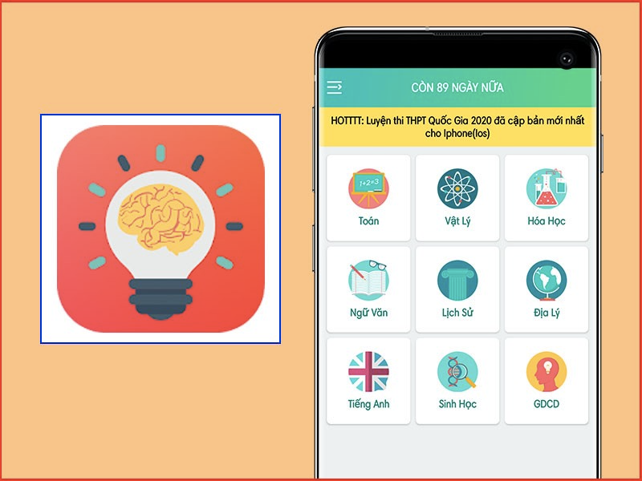

#  
 [Trường đại học Ngoại ngữ - Tin học TP.Hồ Chí Minh](https://huflit.edu.vn/)  
  

## 
 
 Môn:Thực hành CNPMNC 
 

## 
 Đề Tài: App Hệ Thống Thi Trắc nghiệm Online  

  

## 
 Giới Thiệu Chung:
> Three Education là Hệ thống thi trắc nghiệm online dành cho học sinh các cấp trong nhiều năm và có một vài trường học đã áp dụng hình thức thi online này. Để có thể tiếp cận đến nhiều trường học sử dụng hình thức thi trắc nghiệm online, Three Education muốn đẩy mạnh và nâng cấp Hệ thống thi trắc nghiệm online với nhiều hình thức khác nhau và có tính bảo mật cao. 
Trong hệ thống thi trắc nghiệm online, mỗi giáo viên và học sinh đều được cấp 1 tài khoản duy nhất. Khóa học bao gồm các lớp cùng trong một niên khóa.Khi học sinh đăng nhập vào hệ thống, tùy vào thông tin lớp mà học sinh đó học, hệ thống sẽ biết thời gian hôm nay học sinh đó thi môn nào và cho phép học sinh làm bài thi. Sau khi học sinh bấm nộp bài thì hệ thống sẽ tự động đối chiếu với đáp án đúng của giáo viên đã chọn để chấm điểm bài thi đó. Bài thi sẽ theo từng môn học trong một kì của lớp. Bài thi của một môn học sẽ do giáo viên dạy môn học đó cho lớp ra đề thi.
Ngoài ra, giáo viên có thể trực tiếp quản lí học sinh và bài thi của từng học sinh trên hệ thống, điểm danh mỗi buổi học. Đối với mỗi đề thi, giáo viên nhập trực tiếp nội dung đề thi và đáp án vào form có sẵn trên hệ thống.

### 
 Những gì làm được và chưa được:
| Làm được| Chưa được |
|-----------------------------------------|------------------------------------------------------------|
| Quản lý tài khoản | Chưa cập nhật bài thi theo môn |
| Quản lý lớp học | 
| Quản lý môn học |
| Điểm danh | 
| Quản lý bài thi | 
| Làm bài thi | 
| Chấm điểm |

## 
 Thành viên nhóm
| MSSV | Tên sinh viên | Chức vụ | Ảnh|
|--------|------------------------|-----------------------------|------------------------------------------------------------------|
| 21DH114057 | [ Nguyễn Hoàng Anh Quốc](https://github.com/AqGzs) | Team Leader |  |
| 21DH113041  | [ Nguyễn Hoàng Phúc ](https://github.com/hoangphuc210103) | DEV |   |
| 21DH111438 | [ Phan Thị Ngọc Trang ](https://github.com/ngoctrang1903) | Product Owner|   |
| 21DH111391 | [ Lại Quang Phi ](https://github.com/quangphi98) | Scrum Master |   |

## 
 Công nghệ:
- [ Android Studio ](https://developer.android.com/) 
- [ SQLite ](https://www.sqlite.org/index.html) 
- [ Firebase ](https://firebase.google.com/) 
- [ API ](https://mona.media/api-la-gi/) 

